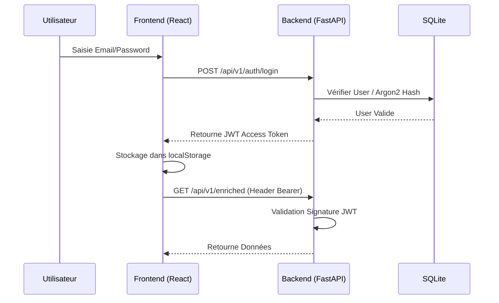

# 🔐 Authentication Guide

Le système utilise une authentification basée sur les **JSON Web Tokens (JWT)** pour sécuriser les données sensibles d'investigation.

## 🔄 Flux d'Authentification



## 🛠️ Configuration Backend
Le secret et l'algorithme sont définis dans les variables d'environnement.

- **Variables Clés**:
  - `SECRET_KEY`: Utilisée pour signer les tokens (indispensable en prod).
  - `ALGORITHM`: Généralement `HS256`.
  - `ACCESS_TOKEN_EXPIRE_MINUTES`: Durée de validité.

## 💻 Implémentation Frontend (`AuthContext`)
La gestion de l'état `user` et `token` est centralisée dans `src/context/AuthContext.jsx`.

### Usage dans les services :
Pour appeler une API protégée, utilisez le helper `authenticatedFetch` dans `src/services/api.js` qui injecte le header `Authorization`.

```javascript
const getAuthHeaders = () => {
    const token = localStorage.getItem('token');
    return token ? { 'Authorization': `Bearer ${token}` } : {};
};
```

## 🛡️ Rôles et Permissions
Le système distingue deux niveaux :
1. **Utilisateur Actif**: Accès aux données d'investigation.
2. **Administrateur** (`is_admin=true`): Accès au dashboard admin et gestion des utilisateurs.

## 👤 Création du Premier Admin
Si la base de données est vide, utilisez le script utilitaire :
```bash
python create_admin.py
```
**Admin par défaut**:
- **Email**: `ba77ath@proton.me`
- **Password**: `Apostroph03`
