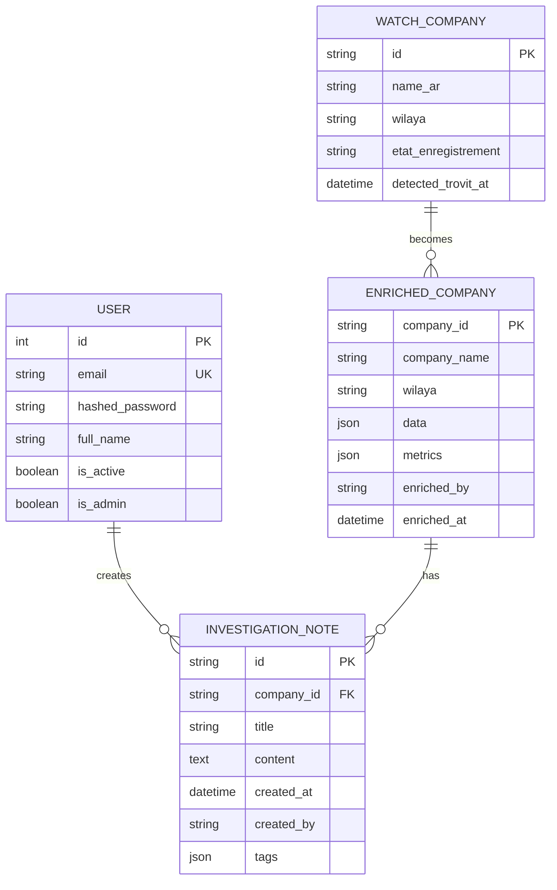

# 🗄️ Database Schema

Le projet utilise **SQLite** pour sa simplicité de déploiement et ses performances suffisantes pour un outil d'investigation spécialisé.

**Fichier**: `backend/ba7ath_enriched.db`

## 📊 Diagramme E-R



---

## 📑 Tables Détail

### 1. `users`
Stocke les identifiants et les niveaux de privilèges.
- `hashed_password`: Hachage sécurisé (Argon2).

### 2. `enriched_companies`
C'est le cœur de la plateforme. Les colonnes `data` et `metrics` sont de type JSON.
- **data**: Contient les données brutes extraites (RNE, JORT, Marchés).
- **metrics**: Contient les scores de risque et la liste des Red Flags détectés.

### 3. `investigation_notes`
Permet aux journalistes d'ajouter des preuves textuelles ou des commentaires sur une société spécifique.

### 4. `watch_companies`
Liste des sociétés identifiées comme "Ahlia" mais non encore trouvées dans les registres officiels (RNE).

---

## 📁 Migration et Initialisation
La base de données est automatiquement créée et les tables initialisées lors du démarrage du backend :
```python
# backend/app/main.py
@app.on_event("startup")
async def startup_event():
    Base.metadata.create_all(bind=engine)
```
