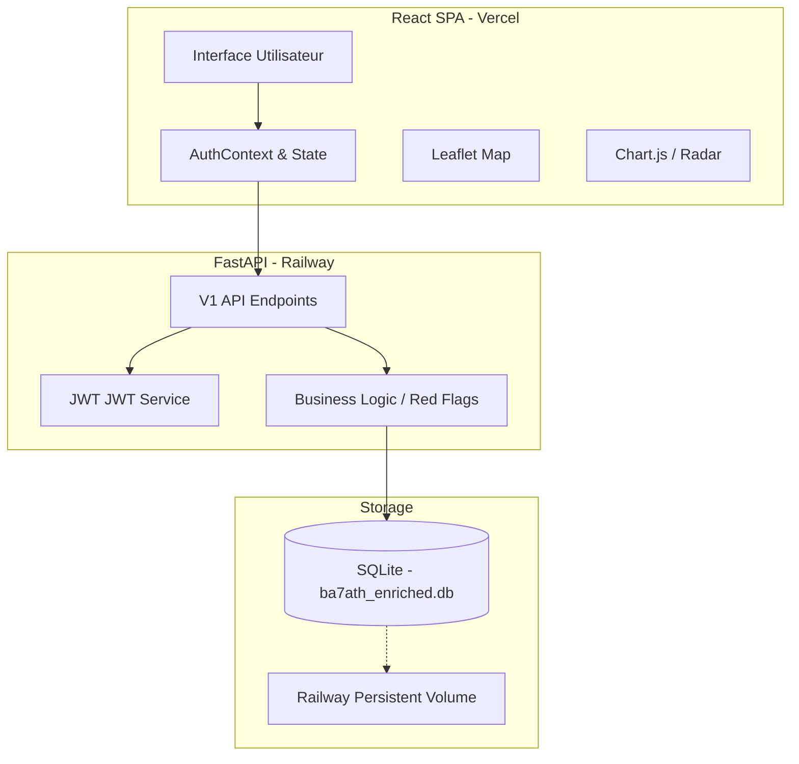

# 📂 Ba7ath / Ahlya Investigations

> **Ba7ath** (البحث - La Recherche) est une plateforme OSINT de datajournalisme dédiée à l'investigation sur les sociétés citoyennes (Ahlia - أهلية) en Tunisie.

[](#)
[](#)

## 📌 Mission
Ce projet permet aux journalistes et analystes d'explorer, de cartographier et d'enrichir les données sur les sociétés Ahlia tunisiennes, en identifiant les anomalies financières, les structures de gouvernance suspectes et les signaux de risque OSINT.

---

## 🏗️ Architecture du Système



---

## 🛠️ Stack Technique

### Backend
- **Framework**: FastAPI (Python)
- **Base de données**: SQLite avec SQLAlchemy ORM.
- **Authentification**: JWT Bearer avec hachage Argon2.
- **Service OSINT**: Logique personnalisée de détection de "Red Flags".

### Frontend
- **Framework**: React 18 (Vite).
- **Styling**: Tailwind CSS pour une interface premium et responsive.
- **Cartographie**: React-Leaflet pour la visualisation géographique des risques.
- **Visualisation**: Chart.js pour les graphiques radar et de comparaison.

---

## 🚀 Quick Start (Local)

### 1. Backend
```bash
cd backend
python -m venv venv
source venv/bin/activate  # venv\Scripts\activate sur Windows
pip install -r requirements.txt
python create_admin.py    # Initialiser l'admin par défaut
uvicorn app.main:app --reload
```

### 2. Frontend
```bash
cd microsite
npm install
npm run dev
```

---

## 📖 Documentation Détaillée

1. [**API Reference**](API_Reference.md) : Détail des endpoints et formats.
2. [**Authentication Guide**](Authentication_Guide.md) : Flux JWT et gestion admin.
3. [**Frontend Architecture**](Frontend_Architecture.md) : Structure des composants et hooks.
4. [**Database Schema**](Database_Schema.md) : Modèles SQLAlchemy et colonnes enrichies.
5. [**Deployment Guide**](Deployment_Guide.md) : Procédures Railway/Vercel.
6. [**OSINT Methodology**](OSINT_Methodology.md) : Calcul des risques et sources.
7. [**Troubleshooting**](Troubleshooting.md) : Problèmes connus et solutions.
8. [**Development Guide**](Development_Guide.md) : Workflow de contribution.

---

## 🕵️ Méthodologie OSINT
La plateforme agrège des données provenant du **RNE** (Registre National des Entreprises), du **JORT** (Journal Officiel) et des données de marchés publics pour générer des scores de risque basés sur :
- Le ratio Capital / Valeur des contrats.
- La fréquence des marchés de gré à gré (بالتراضي).
- La structure de gouvernance (Actionnaire unique, etc.).

---

## ⚖️ Licence
Projet interne - Tous droits réservés.
